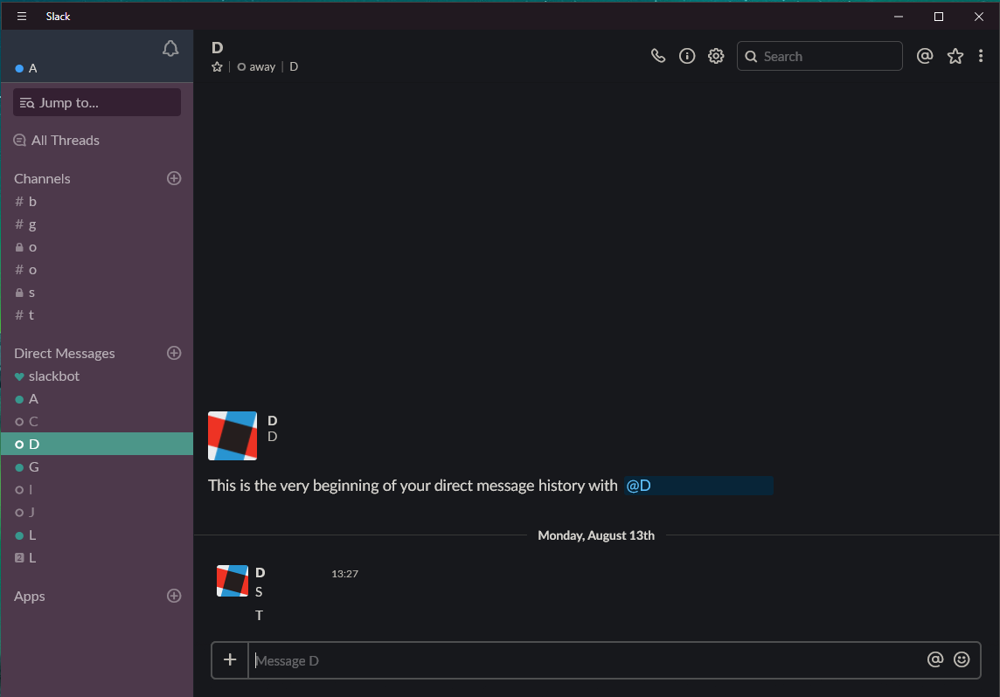

# Slack dark theme injector tool
This tool writes a dark theme to the Slack desktop application.
Dark theme was taken from the generated [Dark Reader](https://darkreader.org)
theme that was applied when I visited the web version of slack, like so:
```
Array.from(document.querySelectorAll('.darkreader')).map((n) => n.textContent).join('\n');

```

### Preview:



### Prerequisites

Install [python](https://www.python.org/)

You _really_ should take the css file from this site, and host it somewhere _you_ control. It's
not a great idea to have a script inject an arbitrary CSS file from a domain outside of your control,
into an application like Slack that could have sensitive data.

Don't trust me - fork the repo.

### Running

Unix
```bash
sudo python makeitdark.py
```
```bash
sudo python3 makeitdark.py
```

Windows
```bash
python makeitdark.py
```
### Sidebar

Add [this sidebar theme](https://slackthemes.net/#/custom#333336,2e2e31,666668,ffffff,277df6,d7d5d4,277df6,277df6) which kinda makes it look like Mojave dark mode:
```
#333336,#2e2e31,#666668,#ffffff,#277df6,#d7d5d4,#277df6,#277df6
```
Or add [this sidebar theme](https://slackthemes.net/#/custom#17181c,252525,A36B31,D2D6D6,5C6380,DEDEDE,ADBA4E,DB6668) for more consistency:
```
#17181c,#252525,#A36B31,#D2D6D6,#5C6380,#DEDEDE,#ADBA4E,#DB6668
```
You can fiddle around with custom sidebar themes at https://slackthemes.net

### Reverting

If you want to uninstall the dark Slack theme you can run with the `makeitlight` option:
```
makeitdark.py makeitlight
```

### Slack Updates

When Slack updates it will overwrite the installed dark theme. When this happens just re-run the tool to make it dark again.

## Authors

* **James Szklarz** - *Initial work* - [LostConnection](https://github.com/LostConnection)
* **Andrew Hayworth** - *Darkreader updates* - [ahayworth](https://github.com/ahayworth)

See also the list of [contributors](https://github.com/LostConnection/makeitdark/contributors) who participated in this project.

## License

This project is licensed under the MIT License - see the [LICENSE](LICENSE) file for details

## Acknowledgments

* Authors of js injection code used
* [Original dark css used](https://github.com/laCour/slack-night-mode)
